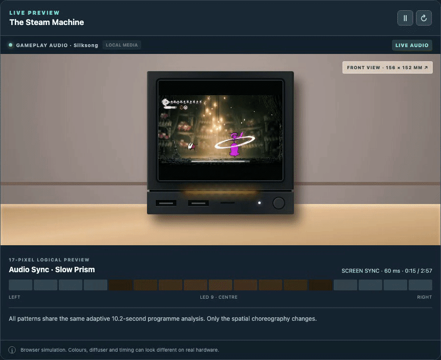

# GabeCubeAura

**GabeCubeAura 1.4.0 adds guided first-time setup, one global Day/Night
brightness control and real thermal protection for the official Steam
Machine's 17-pixel light bar.**

Make your Steam Machine's 17-pixel light bar useful and a little more
expressive. Choose a complete lighting experience, preview it on the physical
bar, then set one brightness level for every display. Optional sunset dimming
uses a city you select manually, while CPU/GPU thermal protection can return
complete control to Valve immediately.

[Download GabeCubeAura 1.4.0](https://github.com/Alyenax/GabeCubeAura/releases/download/v1.4.0/GabeCubeAura-v1.4.0.zip)
· [Release notes](https://github.com/Alyenax/GabeCubeAura/releases/tag/v1.4.0)
· [TW3 SteamRGB companion](https://github.com/Alyenax/TW3-SteamRGB)

[Try the interactive GabeCubeAura preview before installing](https://alyenax.github.io/gabecubeaura-concept/)

## Your everyday display

### Artwork

Carry the current game's colours onto the light bar. Choose Library Hero,
Header, or Capsule artwork and select the best row automatically or manually.
The choice is remembered separately for every game.

Local custom artwork is preferred, including SteamGridDB replacements and
images assigned to non-Steam shortcuts. In Artwork mode, the quick Decky panel
shows the active game image directly above its exact 17-colour sample.


### Performance

Use the bar for CPU, GPU, or both. Mixed mode gives each signal eight LEDs,
with the centre LED off. Length shows load and colour shows temperature.
Responsive, Balanced, and Smooth profiles control how quickly the meter reacts.

Performance can be selected independently for Home, games, or a specific game.
Three ready-made temperature palettes are included, and a native Decky colour
picker lets you choose custom Cool, Middle, and Hot colours.

CPU/GPU sensors are sampled every 0.5 seconds in every display mode. Opening
Performance settings immediately shows fresh readings without first selecting
Performance as the active display. Missing or expired readings are not retained
as if they were live.


### Controller Battery

See controller charge at a glance. Select Controllers as the permanent Home or
In-game display to show one to four fixed battery seats. Two and four
controllers use mirrored layouts. Three controllers use three left-to-right
zones. Dark separators and white charge tips keep every seat readable.

Charging can play a short cue or a continuous blue-and-white animation that
stops at 100%. The Automatic colour preset uses battery colours with one
controller, then distinct P1 to P4 seat colours from two controllers onward.
Manual keeps either colour meaning at every controller count. Choose animation
styles, brightness and alert contexts. This Concept Lab capture shows the
single-controller battery view, then two mirrored gauges and continuous
charging.


Battery and charging data depend on the controller. Unknown levels are never
invented; see the [controller test notes](docs/CONTROLLERS_RESEARCH.md).

### Playtime Countdown

See the time you have left. An active Steam Families limit automatically takes
priority when a game starts, or you can start a personal timer. The bar empties
from right to left, turns amber below 15 minutes, and turns red below five.
During the final eight seconds, three short white flashes repeat until zero.


### Weather

Choose a city, then select Weather as the permanent Home or In-game display.
Twenty-two selectable loops cover clear skies, rain, cloud, partly cloudy day
and night, snow, and storms. Version 1.2.1 adds 8 night transpositions: two moon
scenes, four night-cloud scenes and two moon-through-cloud scenes. They keep
the approved daytime choreography while using a deep blue night field, neutral
clouds and stepped moon whites. **Snow takes hold** is the default snow scene;
all animations can be previewed without network access. Existing selections
are kept.


The SteamOS top-bar weather indicator is enabled by default and appears once a
city is selected. Choose °C or °F and one of three locally bundled icon
styles. This works
independently of the LED weather scene and has been confirmed on one Steam
Machine; Steam UI updates could change its placement. No temperature colours
are mapped to LEDs.


Select a city before enabling live weather. If you enter a country, use its
full name (for example France), not a two-letter code. GabeCubeAura fetches current
conditions from Open-Meteo about every 15 minutes, without an API key or
automatic location detection. The same city can drive global sunset dimming
even when Weather is not selected as a permanent display.

### Light Events

Light events briefly replace the current display, play their animation, then
restore the selected permanent display. They can work outside a game.
Each category has its own switch, animation selector, and nearby live preview.

#### Notification

Return beacon is the fresh-install choice. The GIF below shows Wide echo,
another selectable notification style.


#### Screenshot

An icy shutter closes, followed by two flashes with expanding echoes.


#### Achievement

Constellation round trip is the fresh-install choice. The GIF below shows it.


#### Recording

Two red traces mark recording start and stop. While recording, the centre LED
stays pure red over a compatible permanent display. Its two neighbours are black by
default to keep the marker distinct through the physical diffuser. The marker
never modifies a playtime countdown or another event animation.


### Game Launches

GabeCubeAura can play a one-shot launch sequence when a new
Steam AppID starts. **Game launches is independent from Artwork display**: it
has its own Hero/Header/Capsule source and colour cache, extracts either two or
three dominant colours locally, offers ten patterns, and uses a visible timer
adjustable from 3 to 45 seconds. Short alerts pause that timer and the sequence
resumes after the alert.

The first animation shows three separate AppIDs and the two- or three-colour
palette extracted from each Library Hero. The second stays on Balatro and shows
three of the ten available launch patterns at a deliberately slower pace.
These are browser illustrations generated from the Concept Lab, not proof of
physical LED colour fidelity.


### Customization+

Build a permanent Home or in-game display from one, two, or three exact
opaque colours. Use the colour picker, Hex or RGB values, brightness from 34 to
255, animation speed from 1 to 100, direction, and a live 17-LED
preview. The 65 available effect names are grouped by dynamism: Calm & ambient,
Flowing, and Energetic. Alpha is intentionally absent because the LED hardware
and GabeCubeAura settings use RGB, not transparency.

Steam's native Patrol, Breathe, Rainbow, and Solid presets remain in Steam.
Select **GabeCubeAura Off** to use them; GabeCubeAura does not present approximate
lookalikes as if they were Valve's effects.

The animation below uses one restrained two-colour palette and a slower
Crescendo loop. It is captured from the browser simulator, so diffuser
appearance may differ slightly from the physical Steam Machine.


### Real Time Screen Sync

Screen Sync maps the running game's picture onto the light bar in real time.
Panorama maps 17 horizontal screen zones to the 17 LEDs. Ambient calculates one
calmer colour for the whole image. Processing stays on the Steam Machine,
captured frames remain in memory, and no image is saved or sent over the
network.


The capture runs when Screen Sync is the effective display for a running game,
while Steam's screensaver is active and opted in, or during the 15-second
manual preview. It requests a 34 by 18 pixel Gamescope PipeWire stream at 10
frames per second, detects stable cinematic black bars, reduces bright HUD
influence, smooths scene changes and stops using a frame when it becomes stale.
If recording or another Gamescope capture consumer is detected, the saved
Customization+ effect takes over without competing for the stream.
Every game AppID transition also terminates the former GStreamer process and
starts a fresh Gamescope capture session when Screen Sync is still requested;
this avoids carrying a stale PipeWire client into the next PAUSED preroll.
The read-only capture stays warm while Steam temporarily owns the LEDs. If the
Gamescope or PipeWire session actually disappears, GabeCubeAura closes the old
pipeline first, waits for the session to settle and only then rediscovers it.

Screen Sync has its own settings page for Panorama or Ambient style,
brightness, reactivity, colour intensity, black threshold and black-bar
handling. It can be selected as the in-game default, saved per Steam AppID, or
enabled independently for Steam's screensaver without changing either route.

All existing routing still applies. Choose separate permanent displays for
Home and games, then let temporary launch, playtime and Steam moments take the
stage before the selected display returns.

### Audio Sync

Audio Sync turns the mixed system sound into light locally, without recording
or saving audio. Choose from ten patterns, including Hi-Fi Crest, Slow Prism,
Spectrum and Stereo Field, then combine any pattern with a built-in palette,
custom colours, live Screen Sync colours or the running game's Artwork.

Home and in-game can use different patterns, palettes and custom colours. The
recommended Immersive setup uses Slow Prism with Sapphire at Home and Screen
Sync in games. Its first-run preview plays a short source-independent Slow
Prism and Screen Sync demonstration, so it remains visible without live audio
or a running game. Steam downloads, alerts, Game launches and the screensaver
keep their existing priority.



### Display Routing

Choose one permanent display for Home and another for games: GabeCubeAura Off,
Blackout, Customization+, Artwork (games only), Performance, Screen Sync (games
only), Audio Sync, Weather, or Controllers. A per-game override
can replace the in-game default. Game launches, Playtime, Light events, and
Controller alerts are separate temporary layers, so they work without forcing
a particular permanent display. Choosing GabeCubeAura Off reproduces the former
Signals-only behaviour: GabeCubeAura yields the bar between temporary signals.
Blackout instead keeps ownership and holds all 17 LEDs off.

Nine one-step presets configure a complete setup: Lights out, Essential, Focus,
Moderate, Atmosphere, Signals, Immersive, Immersive+ and Festive. Returning to
Custom restores the setup saved before the first preset was selected.
**Lights out excludes even Valve's download animation.** Essential still lets
Valve show confirmed downloads. Atmosphere uses Weather at Home and falls back
to its Slow Prism display until a current weather frame is available.

Light bar brightness is global and independent from these routes. Day
brightness applies whenever GabeCubeAura owns the bar; optional Night
brightness follows local sunset and sunrise for a manually selected city.
Changing a preset, Home display or in-game display never changes either value.

StripMine is developed by the same author as GabeCubeAura. With StripMine
v0.1.1-alpha.7 or newer, open **Settings > Advanced > Plugin compatibility**
and reveal the TW3-SteamRGB and StripMine controls. Choose which plugin owns
the bar for Artwork, Performance, Weather, Controller displays, Game launches,
Screen Sync, Audio Sync, Customization+ and Light Events while the mine is
active. GabeCubeAura and StripMine acknowledge every transfer before writing,
then restore the previous owner automatically. No manual **Retry bar** action
is required. Playtime countdowns remain GabeCubeAura priorities; unknown
applications still trigger the normal ownership guard.

[TW3 SteamRGB](https://github.com/Alyenax/TW3-SteamRGB) can use the bar as a
live The Witcher 3 HUD. While its fresh ownership claim is active,
GabeCubeAura yields only its permanent display. Steam system activity,
GabeCubeAura previews, alerts, Game launches and playtime countdowns remain
above the game HUD. The former experimental Witcher Lab is not bundled with
GabeCubeAura 1.4.0.

## How priorities work

GabeCubeAura follows a strict order:

1. Thermal protection stops every GabeCubeAura write and returns complete
   control to Valve when the CPU or GPU reaches 94°C.
2. Disabled returns complete control to Steam.
3. Steam hard system priority blocks every GabeCubeAura write during startup,
   downloads and repeated native LED activity.
4. The final five minutes of a countdown cancel and outrank Game launches.
5. Recording start and stop cues surround a Customization+ fallback with a
   persistent red centre marker.
6. Short alerts pause a Game launch's visible timer; the launch resumes after
   the alert.
7. Game launches temporarily replace regular countdowns; those countdowns
   return afterwards.
8. Screen Sync, Audio Sync, Artwork, Performance, Weather, Controllers or Customization+
   provides the selected permanent display.
9. A single native transition is allowed to settle before GabeCubeAura restores its
   expected display. Repeated native writes keep control with Steam.

## Install

### Updates inside GabeCubeAura

GabeCubeAura includes a dedicated **Updates** page. Automatic checks can run
every 15 minutes, 1, 3, 6, 12 or 24 hours, and can show one Decky notification
for each new version on the selected channel. It never installs an update
without confirmation.

Before installation, the plugin verifies HTTPS, the release metadata, archive
size, SHA256 checksum, ZIP paths and package version. Decky then restarts
briefly. Settings and artwork caches remain outside the replaced plugin
directory. If the new backend does not confirm a healthy startup within 45
seconds, the previous plugin version is restored automatically.

The Stable channel is the default, checks every 24 hours and ignores GitHub
prereleases. No private authorization or token is configured on a fresh
installation. The optional
Beta channel accepts published beta releases as well as later stable releases.
Both use the same verification and confirmation flow. Changing the selector to
**Beta** starts a fresh release check immediately for published prereleases.
Returning to Stable explicitly offers the current stable package even when its
version number is lower than an installed beta.

### Decky Loader

1. Install [Decky Loader](https://decky.xyz/).
2. Download `GabeCubeAura-v1.4.0.zip` from the
   [v1.4.0 release](https://github.com/Alyenax/GabeCubeAura/releases/tag/v1.4.0).
   Do not extract it.
3. Open **Decky > Settings > General** and enable **Developer mode** only if the
   **Developer** section is not already visible.
4. Open **Decky > Settings > Developer**. Under **Third-Party Plugins**, choose
   **Install Plugin from ZIP File**, select **Browse**, then select the
   downloaded archive.
5. Restart Decky Loader if the installed plugin does not appear immediately.

### Manual installation

Extract the archive into `~/homebrew/plugins/` so the result is a
`~/homebrew/plugins/GabeCubeAura/` directory, then restart `plugin_loader`.

GabeCubeAura requests Decky's root flag only because the Steam Machine exposes its
light bar through root-owned `valve-leds` sysfs files.

## First setup

1. Open GabeCubeAura in Decky's quick-access menu and select **Open guided
   setup**.
2. Choose Moderate, Atmosphere, Signals or Immersive. Each choice previews its
   representative animation on the physical light bar.
3. Set Day brightness, then optionally choose a city and configure automatic
   Night brightness from its exact sunset and sunrise times.
4. Review the preset, brightness and location, then apply the setup. A visible
   scroll cue points to the final buttons above Steam's controller footer.

Live Light events are enabled on a fresh installation. Controller alerts have
their own switch and work independently of Light events. **Skip guided setup**
applies the recommended Immersive preset and `9/255` Day brightness. Existing
users do not see onboarding again, and their saved settings are kept.

## Configuration

### Artwork

- Library Hero, Header, or vertical Capsule
- Automatic, centre, lower, or manual sample row
- Red line over the image showing the selected manual row
- Saved source and position for each game
- Local SteamGridDB and non-Steam custom artwork support

Steam's Library Logo is not sampled because it is a transparent foreground
layer rather than a complete image.

### Performance

- CPU, GPU, or mixed CPU + GPU
- Both meters left to right, or mirrored toward the centre
- Responsive, Balanced, or Smooth filtering
- Selectable as the Home, In-game, or per-game display
- Three built-in temperature palettes
- Custom Cool, Middle, and Hot colours through Decky's colour picker
- Live CPU/GPU load and temperature in the quick panel

`Cool temperature` and `Hot temperature` are thresholds. The selected colour
palette is blended continuously between them.

### Playtime

- Automatic Steam Families remaining-time signal
- Personal timer from five to 240 minutes
- Five starting colours
- Timer-duration scale or fixed one, two, three, or four-hour full bar
- Final eight-second alert

Steam Families only appears while a game is running. Closing or switching games
clears the old parental countdown immediately.

### Controllers

- Permanent battery gauge selected through Home/In-game display routing
- Brief alert contexts: Off, On Home, In game, or Home + in game
- Connection and low-battery alerts can each be disabled; charging has its own
  Off / Brief / Continuous on Home / Continuous everywhere choice
- Adjustable low-battery threshold from 5% to 30%
- Three selectable styles for each signal, including the multiplayer view
- Fixed layouts for one to four controllers, with automatic mirroring for two
  and four and left-to-right seats for three
- Automatic colour preset: battery colours for one controller, then four
  editable player-seat colours from two controllers onward
- Manual colour preset: keep either Battery level or Player seats at every
  controller count
- Local previews can simulate one to four controllers without changing the
  detected Steam controller roster

The gauge is the permanent display where selected; it does not combine colours
from another display. A Steam Families countdown still wins. Unknown or
coarse battery data is not displayed as an exact percentage.

### Weather

- Location selected manually by city or postal code; no automatic geolocation
- Selectable through Home/in-game routing, with 22 17-LED animations
- Independent optional SteamOS top-bar icon and °C/°F temperature
- Weather brightness and faint-pixel cutoff for the physical diffuser
- Weather previews work without a city or network connection

### Light bar brightness and optical calibration

The physical diffuser can make a lit LED bleed into a neighbouring dark space.
**Extra dark LEDs** compensates by lighting fewer physical pixels than the
logical preview. It affects Countdown and Performance, never Artwork. The
default is two.

The official Steam Machine's physical LED order is reversed by default while
the Decky preview remains left to right.

The global **Light bar brightness** section applies the selected Day brightness
to every Home and in-game route. The recommended starting value is the tested
`9 / 255`. Optional sunset dimming applies a percentage of that value, for
example 35% gives `3 / 255`. The city is shared with Weather, but Weather does
not need to be selected as a display. Important alerts temporarily return to
Day brightness.

Both sliders preview immediately on the physical bar. A red warning appears
when Day brightness or the computed Night output falls below `8/255`, because
such a low value can strongly affect the lighting experience.

GabeCubeAura changes the hardware `brightness_scale` only while it owns the
bar, then restores Steam's exact saved value before handing control back. If a
driver does not expose `brightness_scale`, the panel clearly reports the RGB
attenuation fallback. Thermal protection always returns complete control to
Valve.

### Configuration backup and reset

Open **Advanced / debug > Show debug details** and choose **Export configuration
JSON**. GabeCubeAura writes a readable snapshot of global settings, saved per-game
profiles, and the current game's resolved choices to
`/home/deck/Documents/GabeCubeAura-configuration.json` on a standard SteamOS setup.
The panel always shows the exact path used. Exporting again replaces only that
file, and controller device IDs are never included.

In the same Debug section, **Import configuration JSON** opens a file picker
and asks for confirmation before replacing saved global settings and per-game
profiles. Unsupported or invalid files leave the existing configuration
untouched. **Reset to defaults** asks for confirmation, clears per-game
profiles, and restores the shipped defaults. Neither action deletes the
exported JSON or the artwork cache; both stop a running personal timer.

## Safety and privacy

- No cloud telemetry. Weather city search and Open-Meteo requests occur only
  when you use the optional Weather feature. Private Lab authorization is
  optional, and fresh installations start disconnected without a token.
- No SteamOS read-only filesystem modification
- Local read-only discovery of Steam and custom-grid artwork
- Serialized and rate-limited hardware writes
- Redundant-frame suppression to reduce unnecessary LED writes
- A userspace guard that yields when Steam or another process changes the bar
- A CPU/GPU thermal interlock that yields completely to Valve at 94°C and only
  resumes after both coherent readings stay below 90°C for 30 seconds

GabeCubeAura only restores a previous frame when the hardware still matches its
own last verified write. Missing or incoherent sensor data during a thermal
alert keeps GabeCubeAura disabled. Fixed red remains available as an ordinary
user colour; colour alone is never treated as a thermal warning.

## Requirements and known limits

- Designed for the official Steam Machine 17-pixel `valve-leds` light bar
- Requires Decky Loader on SteamOS
- Screen Sync requires the SteamOS Gamescope PipeWire source, `pw-dump` and
  `gst-launch-1.0`. GabeCubeAura reports missing components and does not install
  system packages automatically.
- CPU and GPU sensors depend on paths exposed by the hardware and SteamOS build
- Steam notifications and recording use private SteamClient callbacks that may
  change between Steam builds
- Achievement animations follow Steam's achievement notification
- Screenshot animations follow a newly written screenshot file
- Controller battery reporting relies on the private SteamInputManager service
  and varies by controller. There is no verified compatibility list for every
  controller and connection type yet.
- No Internet artwork fallback, FPS, network, storage, Moonlight, or Sunshine
  provider yet

## Support GabeCubeAura

If GabeCubeAura makes your Steam Machine a little better, you can support its
development on [Ko-fi](https://ko-fi.com/alyenax). The plugin and its public
releases remain available to everyone.

## Build and test

```bash
corepack pnpm install --frozen-lockfile
corepack pnpm test
corepack pnpm typecheck
corepack pnpm build
corepack pnpm package
```

The installable archives are written to `out/GabeCubeAura-v1.4.0.zip` and
`out/GabeCubeAura.zip`. Their identical SHA256 values are written to
`out/SHA256SUMS`.

See [the Screen Sync implementation notes](docs/SCREEN_SYNC.md)
for the implementation status, safety model and physical test checklist.

See [ARCHITECTURE.md](ARCHITECTURE.md) for provider, arbitration, guard, and
hardware-rendering details. Release history is available in
[CHANGELOG.md](CHANGELOG.md).

## Uninstall and license

Use Decky's plugin settings to uninstall GabeCubeAura. Settings remain in Decky's
normal plugin settings directory and can be removed separately if desired.

GabeCubeAura is released under the [BSD 3-Clause License](LICENSE).
